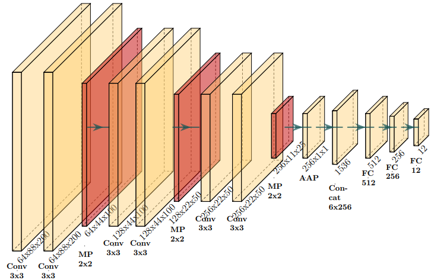

# Bug Classification from Volumetric Scans
Repository containing code related to our final project in the DTU course 02456 Deep Learning on classification of bugs from volumetric data.

## Recreating important results in notebook
In order to run `BugClassification_illustrations.ipynb` follow the in structions in the downloads file. Place the extracted folders in the root directory alongside lib and results_data.

Due to size of the datasets, we do not include them directly in the GitHub. We also do not provide code for training the models, as this is computationally heavy. We provide code that loads in our (selected) pretrained models and calculate their test accuracy. This will recreate Table 1 in our report.

We also supply code to recreate other plots from our report.

## 

By Christian Bjerregaard and Aske Rove at The Technical Univeristy of Denmark. 2025.
